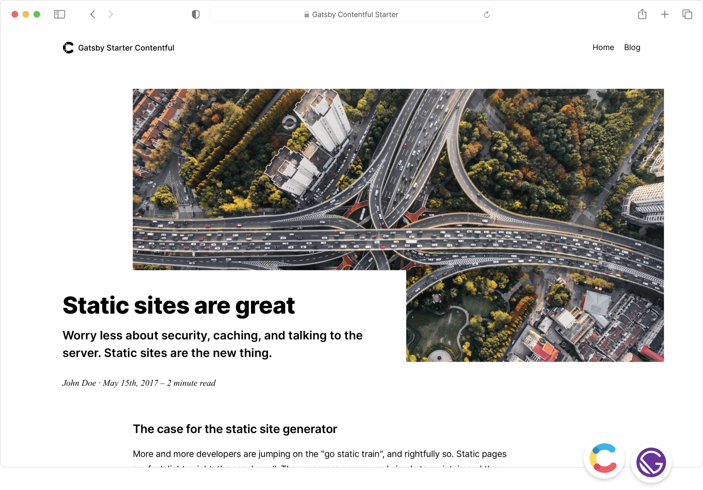

# Contentful Gatsby Starter Blog

Here’s a clean and well-structured **README.md** for your project, documenting the updates and core functionality.

---

## 🚀 **Project Name**

This is a Gatsby project that leverages Contentful CMS for content management and the latest **Gatsby Image** API for optimized image rendering. The project includes updates to ensure hero images are properly displayed on the **Home**, **Blog**, and **Tag** pages.

---

### 📋 **Project Overview**

The project integrates:

1. **Contentful CMS**: Pulling blog posts, authors, and hero images.
2. **Gatsby Image (gatsby-plugin-image)**: Optimized image rendering using `gatsbyImageData`.
3. **React Components**: Reusable components such as `Hero` and `ArticlePreview`.
4. **Rich Text Rendering**: Using `gatsby-source-contentful/rich-text` to display rich text content.

---

### 🔄 **Key Updates**

#### **1. Query Fixes**

The queries for **Home**, **Blog**, and **Tag** pages now use the correct `gatsbyImageData` field for images.

- **Home Page Query**:

```graphql
heroImage {
  gatsbyImageData(
    layout: FULL_WIDTH
    placeholder: BLURRED
    width: 424
    height: 212
  )
  title
}
```

- **Blog Page Query**:

```graphql
heroImage {
  gatsbyImageData(
    layout: FULL_WIDTH
    placeholder: BLURRED
    width: 424
    height: 212
  )
  title
}
```

- **Author Image Query**:

```graphql
heroImage: image {
  gatsbyImageData(layout: CONSTRAINED, placeholder: BLURRED, width: 1180)
  title
}
```

---

#### **2. Hero Component Update**

The `Hero` component was updated to support `gatsbyImageData`:

```jsx
import { GatsbyImage, getImage } from 'gatsby-plugin-image'

const Hero = ({ image, title, content }) => (
  <div>
    {image && (
      <GatsbyImage
        alt={title || 'Hero image'}
        image={getImage(image)} // Support for gatsbyImageData
      />
    )}
    <h1>{title}</h1>
    {content && renderRichText(content)}
  </div>
)
```

---

#### **3. ArticlePreview Component**

Ensures hero images are displayed for blog posts:

```jsx
const image = heroImage ? getImage(heroImage.gatsbyImageData) : null

<GatsbyImage
  alt={heroImage.title || `Image for ${title}`}
  image={image}
/>
```

---

### 🛠️ **Technologies Used**

- **Gatsby**: Static site generation.
- **Contentful**: Headless CMS.
- **gatsby-plugin-image**: Optimized image loading.
- **React**: Component-based architecture.
- **Lodash**: Utility functions.

---

### 🧩 **Project Structure**

```
/src
- gatsby-config.js
- gatsby-node.js
  /components
    /ui
      - button.js
      - article-preview.js
      - article-preview.module.css
      - Footer.js
      - footer.module.css
      - Hero.js
      - hero.module.css
      - Navigation.js
      - navigation.module.css      
    - container.js
    - global.css
    - layout.js    
    - seo.js
    - tags.js
    - tags.module.css
  /templates
    - blog-post.js
    - blog-post.module.css
    - tag.js
  /pages
    - index.js       # Home Page
    - blog.js        # Blog Page
    - 404.js         # 404 Page
    - about.js       # About Page
```

---

### 💻 **How to Run the Project**

1. Clone the repository:

   ```bash
   git clone <repository-url>
   cd <project-directory>
   ```

2. Install dependencies:

   ```bash
   npm install
   ```

3. Add your **Contentful API Keys** in `.env`:

   ```plaintext
   CONTENTFUL_SPACE_ID=your_space_id
   CONTENTFUL_ACCESS_TOKEN=your_access_token
   ```

4. Run the development server:

   ```bash
   gatsby develop
   ```

5. Visit the site:

   ```plaintext
   http://localhost:8000
   ```

---

### 🏆 **Features**

1. **Dynamic Blog Posts**: Automatically generated pages for blog posts and tags.
2. **Optimized Images**: Efficient image rendering with lazy loading.
3. **Rich Text Support**: Contentful’s rich text is rendered seamlessly.
4. **SEO-Friendly**: Built-in SEO with optimized metadata and images.

---

### 🎯 **Screenshots**

**Home Page**:


**Blog Page**:


---

### 🚧 **Future Improvements**

- Add pagination for blog posts.
- Implement search functionality.
- Optimize accessibility (a11y) for images and interactive components.

---

### 🤝 **Contributing**

Contributions are welcome! To contribute:

1. Fork the repository.
2. Create a new branch (`git checkout -b feature-branch`).
3. Commit changes (`git commit -m "Your message"`).
4. Push and submit a Pull Request.

---

### 📜 **License**

This project is licensed under the [MIT License](LICENSE).

---

### 📧 **Contact**

For any questions, contact me at **[your.email@example.com](mailto:your.email@example.com)** or connect on GitHub: **[@yourusername](https://github.com/yourusername)**.

---

This README file provides a clear explanation of the updates, project structure, and usage instructions. Let me know if you'd like adjustments! 🚀

---

Create a [Gatsby](http://gatsbyjs.com/) blog powered by [Contentful](https://www.contentful.com).



Static sites are scalable, secure and have very little required maintenance. They come with a drawback though. Not everybody feels good editing files, building a project and uploading it somewhere. This is where Contentful comes into play.

With Contentful and Gatsby you can connect your favorite static site generator with an API that provides an easy to use interface for people writing content and automate the publishing using services like [Travis CI](https://travis-ci.org/) or [Netlify](https://www.netlify.com/).

## Features

- Simple content model and structure. Easy to adjust to your needs.
- Use the [synchronization feature](https://www.contentful.com/developers/docs/references/content-delivery-api/#/reference/synchronization) of our [Delivery API](https://www.contentful.com/developers/docs/references/content-delivery-api/).
- Responsive/adaptive images via [gatsby-plugin-image](https://www.gatsbyjs.org/packages/gatsby-plugin-image/) and our [Images API](https://www.contentful.com/developers/docs/references/content-delivery-api/#/reference/synchronization/initial-synchronization-of-entries-of-a-specific-content-type).

## Getting started

See our [official Contentful getting started guide](https://www.contentful.com/developers/docs/tutorials/general/get-started/).

### Get the source code and install dependencies

```
git clone https://github.com/contentful/starter-gatsby-blog.git
npm install
```

Or use Gatsby Cloud

Use Deploy Now to get started in [Gatsby Cloud](https://gatsbyjs.com/products/cloud):

[](https://www.gatsbyjs.com/dashboard/deploynow?url=https://github.com/contentful/starter-gatsby-blog)

If you use Deploy Now, Gatsby Cloud will run the `gatsby-provision` script on your behalf, if you choose, after you Quick Connected to your empty Contentful Space. That script will add the necessary content models and content to support this site.

Or use the [Gatsby CLI](https://www.npmjs.com/package/gatsby-cli).

```
gatsby new contentful-starter-blog https://github.com/contentful/starter-gatsby-blog/
```

### Set up of the needed content model and create a configuration file

This project comes with a Contentful setup command `npm run setup`.

This command will ask you for a space ID, and access tokens for the Contentful Management and Delivery API and then import the needed content model into the space you define and write a config file (`./.contentful.json`).

`npm run setup` automates that for you but if you want to do it yourself rename `.contentful.json.sample` to `.contentful.json` and add your configuration in this file.

## Crucial Commands

### `npm run dev`

Run the project locally with live reload in development mode.

### `npm run build`

Run a production build into `./public`. The result is ready to be put on any static hosting you prefer.

### `npm run serve`

Spin up a production-ready server with your blog. Don't forget to build your page beforehand.

## Deployment

See the [official Contentful getting started guide](https://www.contentful.com/developers/docs/tutorials/general/get-started/).

## Contribution

Feel free to open pull requests to fix bugs. If you want to add features, please have a look at the [original version](https://github.com/contentful-userland/gatsby-contentful-starter). It is always open to contributions and pull requests.

You can learn more about how Contentful userland is organized by visiting [our about repository](https://github.com/contentful-userland/about).
